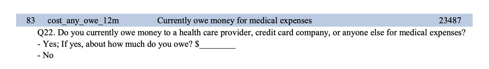

```{r setup, include=FALSE}
knitr::opts_chunk$set(echo = TRUE)
```

# Does receiving Medicaid reduce medical debt?

In 2008, in response to the ACA's mandate that states expand Medicaid eligibility, Oregon used a lottery to randomly assign people to receive Medicaid ([see here](https://www.nber.org/programs-projects/projects-and-centers/oregon-health-insurance-experiment) for more details). Researchers tracked (and continue to track) a whole host of health and financial outcomes as a result of receiving access to Medicaid. 

You're going to investigate the effect of Medicaid on one outcome:



## Load data

```{r}
#| label: libraries-data
#| warning: false
#| message: false

library(tidyverse)
library(parameters)

oregon <- read_csv("data/oregon.csv")
```


## Clean data

There are two categorical columns in this dataset. It will make it easier to calculate differences in proportions if we have numeric versions of the columns too. Use `mutate()` and `case_when()` or `ifelse()` (look at the dplyr cheatsheet) to add two new columns:

- `treatment_num`: 0 if not treated, 1 if treated
- `outcome_num`: 0 if the person doesn't owe money, 1 if the person does owe money

```{r}
oregon_clean <- oregon |> 
  mutate(treatment_num = ifelse(treatment == "Treated", 1, 0)) |> 
  mutate(outcome_num = ifelse(owe_medical_12 == "Owe Money", 1, 0))
```


## Find the difference in outcome caused by treatment

```{r}
oregon_clean |> 
  group_by(treatment_num) |> 
  summarize(prop = mean(outcome_num)) |> 
  mutate(diff = prop - lag(prop))
```

```{r}
model_rct <- lm(outcome_num ~ treatment_num, data = oregon_clean)
model_parameters(model_rct, verbose = FALSE)
```

```{r}
library(marginaleffects)
plot_predictions(model_rct, condition = "treatment_num")
avg_comparisons(model_rct, newdata = datagrid(treatment_num = 0:1))
```

## Bonus: Use logistic regression

```{r}
#| message: false

ggplot(oregon_clean, aes(x = treatment_num, y = outcome_num)) + 
  geom_point() +
  # geom_point(position = position_jitter(width = 0.25, height = 0.25), alpha = 0.1) + 
  geom_smooth(method = "lm")
```


```{r}
#| message: false

model_rct_logit <- glm(
  outcome_num ~ treatment, 
  data = oregon_clean, 
  family = binomial(link = "logit")
)

model_parameters(model_rct_logit)
model_parameters(model_rct_logit, exponentiate = TRUE, verbose = FALSE)
```


```{r}
plot_predictions(model_rct_logit, condition = "treatment")
avg_comparisons(model_rct_logit, newdata = datagrid(treatment = unique))
```
