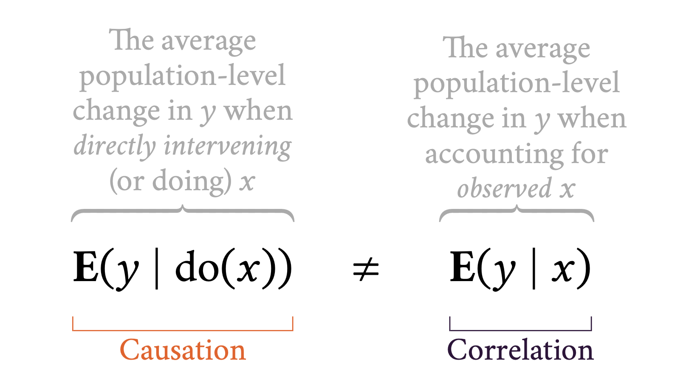
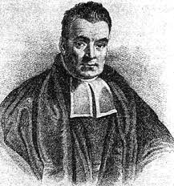
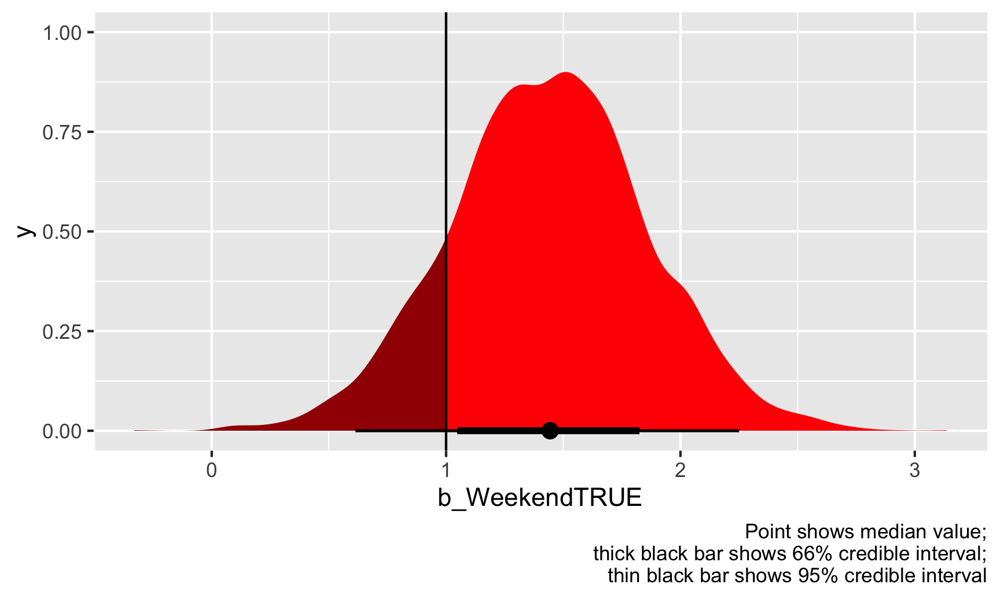
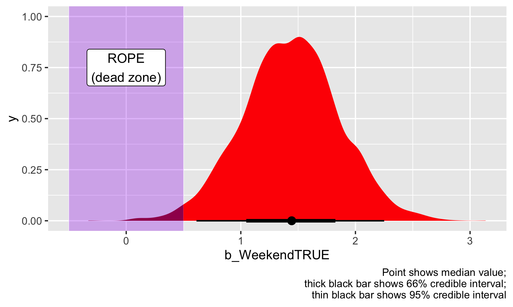
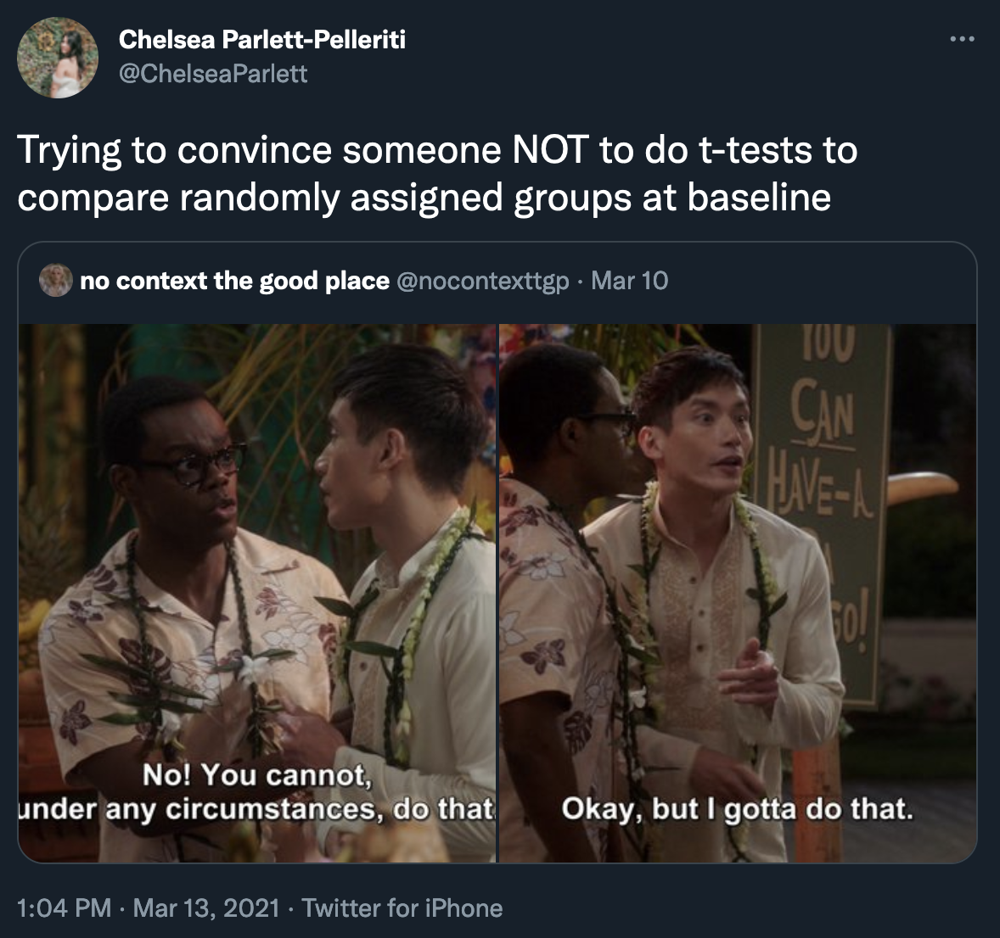
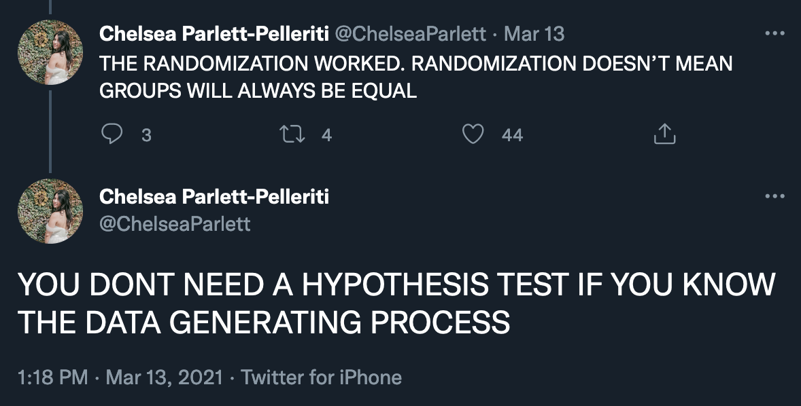
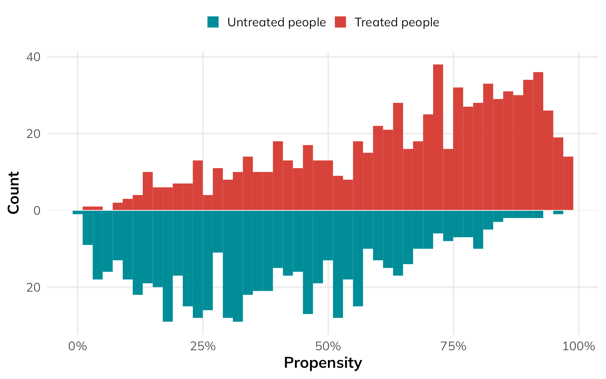
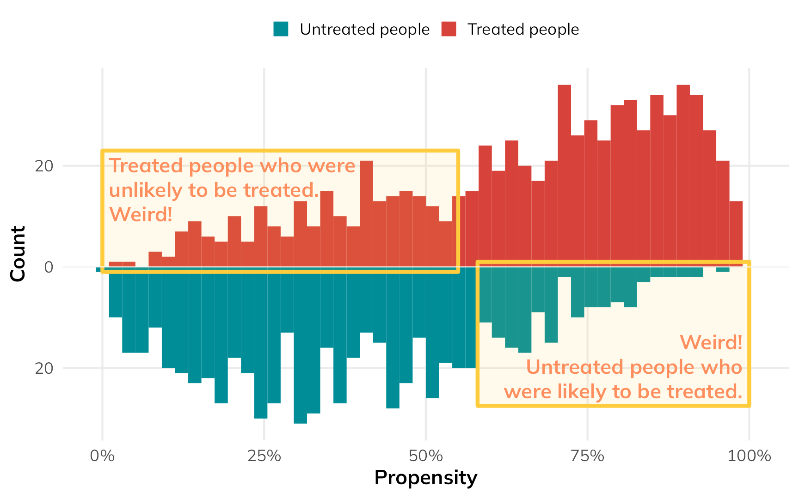

```{r setup, include=FALSE}
knitr::opts_chunk$set(warning = FALSE, message = FALSE, 
                      fig.retina = 3, fig.align = "center")
```

```{r packages-data, include=FALSE}
library(tidyverse)
library(ggdag)
library(palmerpenguins)
library(modelsummary)
```

```{r xaringanExtra, echo=FALSE}
xaringanExtra::use_xaringan_extra(c("tile_view"))
```

class: center middle main-title section-title-3

# In-person<br>session 8

.class-info[

**March 5, 2026**

.light[PMAP 8521: Program evaluation<br>
Andrew Young School of Policy Studies
]

]

---

name: outline
class: title title-inv-8

# Plan for today


--

.box-5.medium[do()]

--

.box-3.medium[*p*-values and confidence intervals]

--

.box-2.medium[RCTs]

--

.box-6.medium[Matching and IPW]

---

layout: false
name: po-do
class: center middle section-title section-title-2 animated fadeIn

# do()

---

layout: true
class: title title-5

---

# Expectations

<br>

.large[
$$\operatorname{E}(\cdot)\qquad\mathbf{E}(\cdot)\qquad\mathbb{E}(\cdot)$$
]

.box-inv-5.small[Basically a fancy way of saying "average"]

---

layout: true
class: middle

---

.box-5.large[andhs.co/potential-outcomes]

---

layout: true
class: title title-5

---

# Causal effects with potential outcomes

$$
\begin{aligned}
& \textbf{Potential outcomes notation:} \\
\delta\ =&\ {\textstyle \frac{1}{n} \sum_{i=1}^n} Y_i (1) - Y_i (0) \\
& \\
& \text{or alternatively with } \textbf{E} \\
\delta\ =&\ \textbf{E} [Y_i (1) - Y_i (0)] \\
\end{aligned}
$$

---

# Causal effects with do()

$$
\begin{aligned}
& \textbf{Pearl notation:} \\
\delta\ =&\ \textbf{E}[Y_i \mid \operatorname{do}(X = 1) - Y_i \mid \operatorname{do}(X = 0)] \\
& \\
& \text{or more simply} \\
\delta\ =&\ \textbf{E} [Y_i \mid \operatorname{do}(X)] \\
\end{aligned}
$$

---

layout: false
class: middle

<br>

.large[
$$
\begin{aligned}
\textbf{E} [Y_i\ \mid\ &\operatorname{do}(X)] \quad  \\
&= \\
\quad \textbf{E} [Y_i (1&) - Y_i (0)]
\end{aligned}
$$
]

---

.box-5.medium[We can't see this]

$$\textbf{E} [Y_i \mid \operatorname{do}(X)] \quad \text{or} \quad \textbf{E} [Y_i (1) - Y_i (0)]$$

.box-5.medium[So we find the average causal effect (ACE)]

$$
\hat{\delta} = \textbf{E} [Y_i \mid X = 1] - \textbf{E} [Y_i \mid X = 0]
$$

---

.center[
<figure>
  
</figure>
]

---

layout: false
class: center middle section-title section-title-3 animated fadeIn

# *p*-values and<br>confidence intervals

---

class: middle

.box-3.large[In the absence of *p*-values,<br>I'm confused about how<br>we report… significance?]

---

layout: true
class: title title-3

---

# Imbens and *p*-values

.box-inv-3[Nobody really cares about *p*-values]

--

.box-inv-3[Decision makers want to know<br>a number or a range of numbers—<br>some sort of effect and uncertainty]

--

.box-inv-3[Nobody cares how likely a number would be<br>in an imaginary null world!]

---

# Imbens's solution

.box-inv-3[Report point estimates and some sort of range]

> "It would be preferable if reporting standards emphasized confidence intervals or standard errors, and, even better, Bayesian posterior intervals."

--

.pull-left[
.box-inv-3[Point estimate]

.box-3.small[The single number you calculate<br>(mean, coefficient, etc.)]
]

.pull-right[
.box-inv-3[Uncertainty]

.box-3.small[A range of possible values]
]

---

# Population parameter

.box-inv-3.large[Truth = Greek letter]

.box-3[An single unknown number that is true for the entire population]

--

.box-inv-3.small[Proportion of left-handed students at GSU]

.box-inv-3.small[Median rent of apartments in Atlanta]

.box-inv-3.small[Proportion of red M&Ms produced in a factory]

.box-inv-3.small[Treatment effect of your program]

---

# Samples and estimates

.box-inv-3.medium[We take a sample and make a guess] 

--

.box-3[This single value is a *point estimate*]

.box-3.small[(This is the Greek letter with a hat)]

---

# Nets and confidence intervals

.box-inv-3.medium[How confident are we that the sample<br>picked up the population parameter?]

--

.box-inv-3.medium[Confidence interval is a net]

--

.box-3[We can be X% confident that our net is<br>picking up that population parameter]

.box-inv-3.small[If we took 100 samples, at least 95 of them would have the<br>true population parameter in their 95% confidence intervals]

---

layout: false

> A city manager wants to know the true average property value of single-owner homes in her city. She takes a random sample of 200 houses and builds a 95% confidence interval. The interval is ($180,000, $300,000).

--

.box-3[We're 95% confident that the<br>interval ($180,000, $300,000)<br>captured the true mean value]

---

layout: true
class: title title-3

---

# WARNING

--

.box-inv-3.medium[It is way too tempting to say <br>“We’re 95% sure that the<br>population parameter is X”]

--

.box-3[People do this all the time! People with PhDs!]

--

.box-3[YOU will do this too]

???

OpenIntro Stats p. 186

First, notice that the statements are always about the population parameter, which considers all American adults for the energy polls or all New York adults for the quarantine poll.

We also avoided another common mistake: incorrect language might try to describe the confidence interval as capturing the population parameter with a certain probability. Making a probability interpretation is a common error: while it might be useful to think of it as a probability, the confidence level only quantifies how plausible it is that the parameter is in the given interval.

Another important consideration of confidence intervals is that they are only about the population parameter. A confidence interval says nothing about individual observations or point estimates. Confidence intervals only provide a plausible range for population parameters.

---

# Nets

.box-inv-3.medium[If you took lots of samples,<br>95% of their confidence intervals<br>would have the single true value in them]

---

# Frequentism

.box-inv-3.medium[This kind of statistics is called "frequentism"]

--

.box-3[The population parameter θ is fixed and singular<br>while the data can vary]

$$
P(\text{Data} \mid \theta)
$$

--

.box-3[You can do an experiment over and over again;<br>take more and more samples and polls]

---

# Frequentist confidence intervals

.box-inv-3.medium.sp-before["We are 95% confident that this net<br>captures the true population parameter"]

--

.box-3.medium.sp-before[~~"There's a 95% chance that the<br>true value falls in this range"~~]

---

layout: true
class: title title-3

---

# Bayesian statistics

.pull-left[
.center[
<figure>
  
  <figcaption>Rev. Thomas Bayes</figcaption>
</figure>
]
]

.pull-right.small[

$$P(\theta \mid \text{Data})$$

&nbsp;

$$\color{orange}{P(\text{H} \mid \text{E})} = \frac{\color{red}{P(\text{H})} \times\color{blue}{P(\text{E} \mid \text{H})}}{\color{black}{P(\text{E})}}$$

]

---

layout: true
class: middle

---

$$\color{orange}{P(\text{H} \mid \text{E})} = \frac{\color{red}{P(\text{H})} \times\color{blue}{P(\text{E} \mid \text{H})}}{\color{black}{P(\text{E})}}$$

&nbsp;

$$
\color{orange}{P(\text{Hypothesis} \mid \text{Evidence})} = 
$$

$$
\frac{
\color{red}{P(\text{Hypothesis})} \times
\color{blue}{P(\text{Evidence} \mid \text{Hypothesis})}
}{
\color{black}{P(\text{Evidence})}
}
$$
---

.box-3.huge[But the math is too hard!]

.box-inv-3[So we simulate!]

.box-inv-3.small[(Monte Carlo Markov Chains, or MCMC)]

---

layout: true
class: title title-3

---

# Bayesianism and parameters

.center[
.pull-left-wide[
.box-inv-3[In the world of frequentism,<br>there's a fixed population parameter<br>and the data can hypothetically vary]
]

.pull-right-narrow[
$$
P(\text{Data} \mid \theta)
$$
]
]

--

.center[
.pull-left-wide[
.box-inv-3[In the world of Bayesianism,<br>the data is fixed .small[(you collected it just once!)]<br>and the population parameter can vary]
]

.pull-right-narrow[
$$
P(\theta \mid \text{Data})
$$
]
]

???

In frequentism land, the parameter is fixed and singular and the data can vary - you can do an experiment over and over again, take more and more samples and polls

In Bayes land, the data is fixed (you collected it, that's it), and the parameter can vary

---

# Bayesian credible intervals

.box-3.small[(AKA posterior intervals)]

.box-inv-3.medium.sp-before["Given the data, there is a 95% probability<br>that the true population parameter<br>falls in the credible interval"]

???

> a Bayesian statistician would say “given our observed data, there is a 95% probability that the true value of θ falls within the credible region” while a Frequentist statistician would say “there is a 95% probability that when I compute a confidence interval from data of this sort, the true value of θ will fall within it”.
(https://freakonometrics.hypotheses.org/18117)

> Note how this drastically improve the interpretability of the Bayesian interval compared to the frequentist one. Indeed, the Bayesian framework allows us to say “given the observed data, the effect has 95% probability of falling within this range”, compared to the less straightforward, frequentist alternative (the 95% Confidence* Interval) would be “there is a 95% probability that when computing a confidence interval from data of this sort, the effect falls within this range”.
(https://easystats.github.io/bayestestR/articles/credible_interval.html)

---

# Intervals

.pull-left[
.box-inv-3.medium[Frequentism]

.box-3[There's a 95% probability<br>that the range contains the true value]

.box-3[Probability of the range]

.box-inv-3[Few people naturally<br>think like this]
]

.pull-right[
.box-inv-3.medium[Bayesianism]

.box-3[There's a 95% probability<br>that the true value falls in this range]

.box-3[Probability of the actual value]

.box-inv-3[People *do* naturally<br>think like this!]
]

???

There's a 95% probability that the range contains the true value (freq) - We are 95% confident that this net captures the true population parameter
vs.
There's a 95% probability that the the true value falls in this range (bayes)

This is a minor linguistic difference but it actually matters a lot! With frequentism, you have a range of possible values - you don't really know the true parameter, but it's in that range somewhere. Could be at the very edge, could be in the middle. With Bayesianism, you focus on the parameter itself, which has a distribution around it. It could be on the edge, but is most likely in the middle

Probability of range boundaries vs probability of parameter values

Bayesian p-value = probability that it's greater than 0 - you can say that there's a 100% chance that the coefficient is not zero, no more null worlds!

---

# Thinking Bayesianly

.box-inv-3.less-medium[We all think Bayesianly,<br>even if you've never heard of Bayesian stats]

.box-3[Every time you look at a confidence interval, you inherently think that the parameter is around that value, but that's wrong!]

--

.box-inv-3.less-medium.sp-before[BUT Imbens cites research that<br>that's actually generally okay] 

.box-3[Often credible intervals are super similar to confidence intervals]


---

# Bayesian inference

.box-inv-3.medium[Inference without *p*-values!]

--

.pull-left[
.box-5.small[Probability<br>of direction]

<figure>
  
</figure>
]

--

.pull-right[
.box-3.small[Region of practical<br>equivalence (ROPE)]

<figure>
  
</figure>
]


---

layout: false
name: rcts
class: center middle section-title section-title-2 animated fadeIn

# RCTs

---

layout: true
class: middle

---

.center[
<figure>
  
</figure>
]

???

[Coins](http://www.freestockphotos.biz/stockphoto/8215)

---

.box-2.large[Do we really not control<br>for things in an RCT?]

---

.box-2.large[Randomness and arrow deletion]

???

> Since every arrow should reflect a causal relationship, it’s not possible for there to be an arrow pointing from a covariate to the allocation, since it is done at random. With no arrow pointing to the exposure, there can be no unblocked backdoor path, and thus no confounding. Voilà. <https://statsepi.substack.com/p/out-of-balance>

---

.box-2.large[Balance tests]

???

Stratified randomization is okay

<https://twitter.com/ChelseaParlett/status/1370798053691514882>

---

.center[
<figure>
  
</figure>
]

---

.center[
<figure>
  
</figure>
]

---

.box-2.large[Can you walk through an example of<br>RCTs in class?]

---

layout: false
name: matching-ipw
class: center middle section-title section-title-6 animated fadeIn

# Matching and IPW

---

layout: true
class: middle

---

.box-6.large[Can you talk more about<br>propensity scores and<br>"weirdness" weights?]

.center.small[[Lecture slide](https://evalsp25.classes.andrewheiss.com/slides/07-slides.html#128)]

---

.center[
<figure>
  
</figure>
]

---

.center[
<figure>
  
</figure>
]

---

.center[
<figure>
  
</figure>
]

---

.box-6.large[Why not just control for confounders<br>instead of doing the whole matching/IPW dance?]

---

.box-6.large[Do you have to use<br>logistic regression + OLS for IPW?]

--

.box-inv-6[[No!](https://www.causalml-book.org/)]

---

.box-6.large[Which should we use?<br>Matching or IPW?]

---

.box-6.large[Can you walk through an example of<br>IPW and matching in class?]
