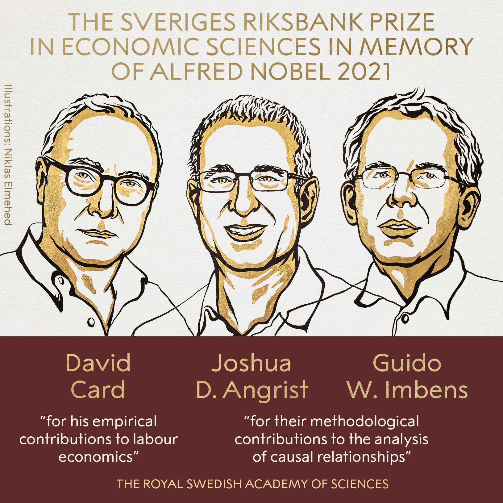
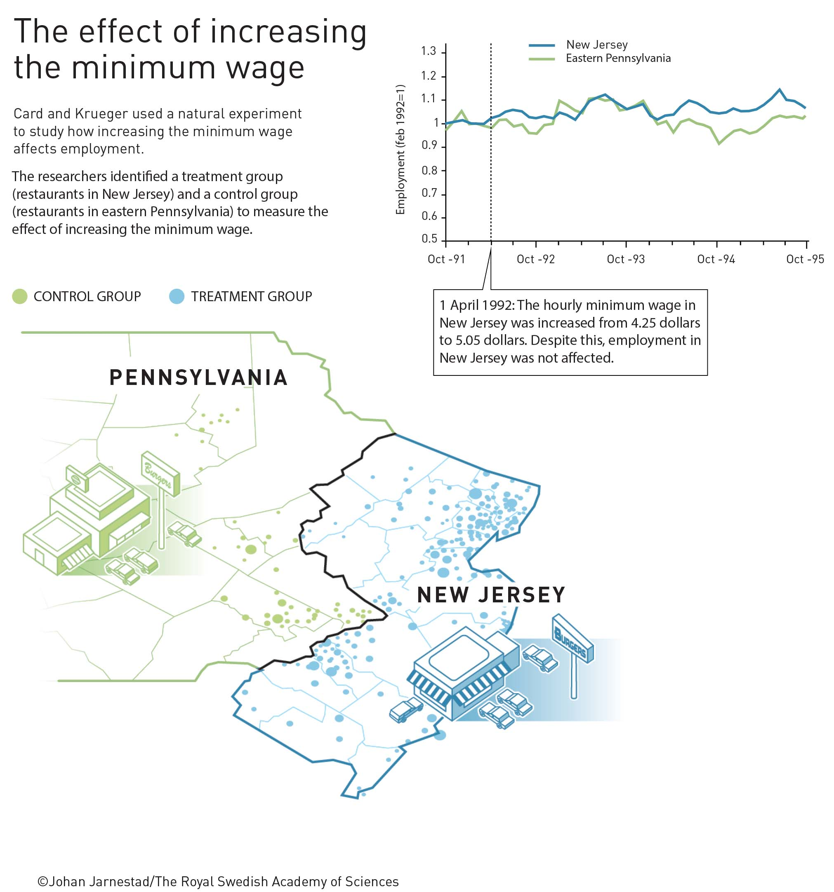
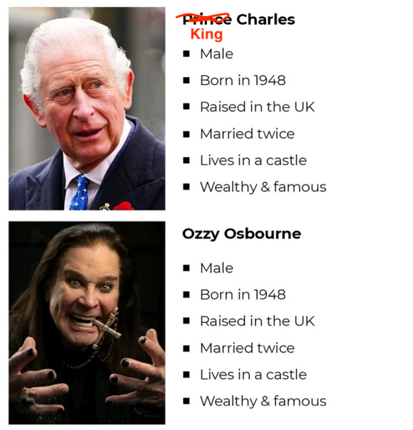
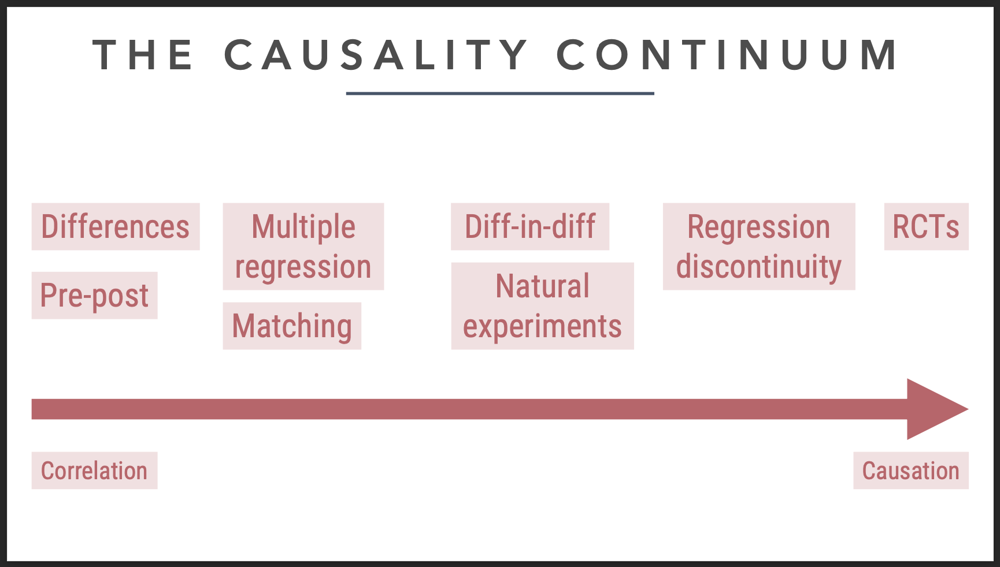
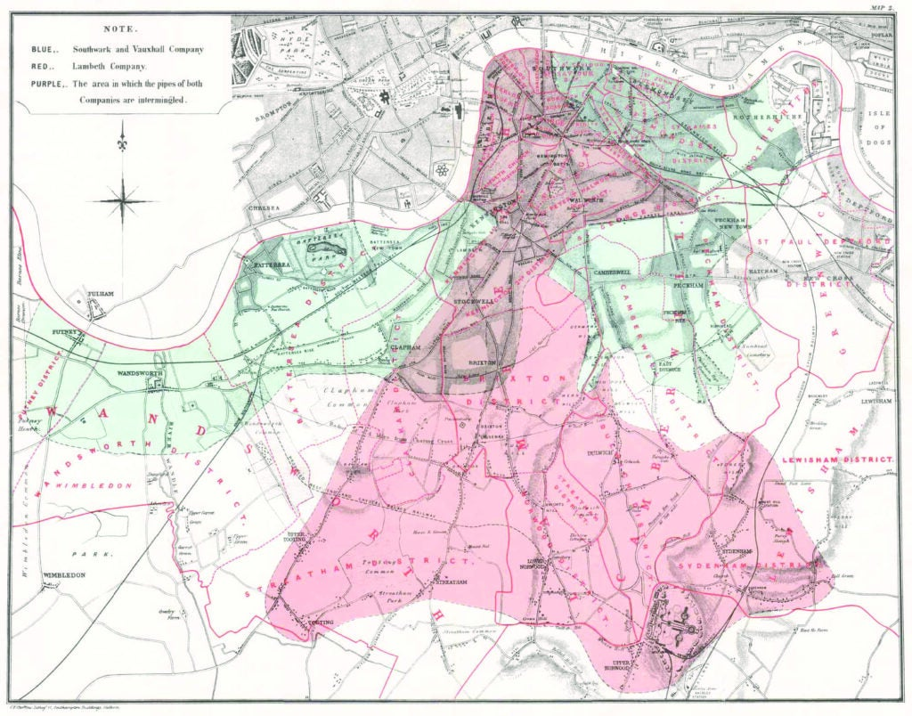
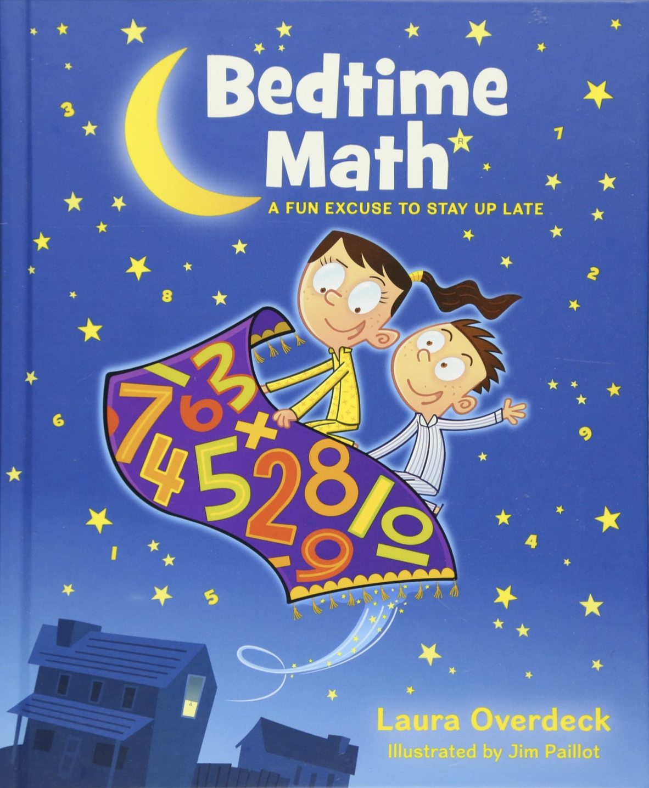
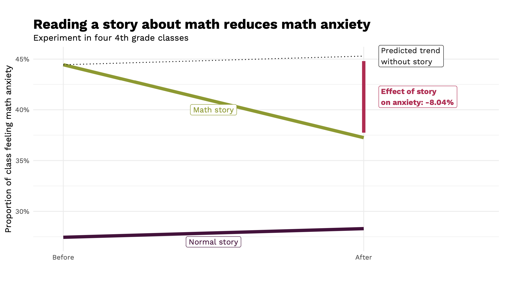
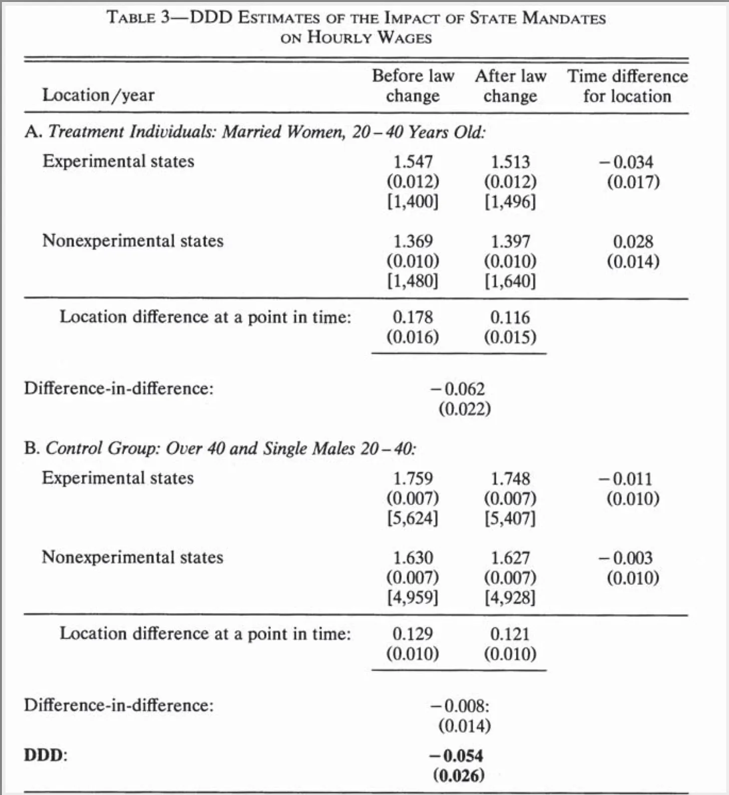

```{r setup, include=FALSE}
knitr::opts_chunk$set(warning = FALSE, message = FALSE, 
                      fig.retina = 3, fig.align = "center")
```

```{r packages-data, include=FALSE}
library(tidyverse)
library(ggdag)
library(palmerpenguins)
library(modelsummary)
```

```{r xaringanExtra, echo=FALSE}
xaringanExtra::use_xaringan_extra(c("tile_view"))
```

class: center middle main-title section-title-3

# In-person<br>session 9

.class-info[

**March 12, 2026**

.light[PMAP 8521: Program evaluation<br>
Andrew Young School of Policy Studies
]

]

---

name: outline
class: title title-inv-8

# Plan for today

--

.box-5.medium.sp-after-half[Adjustment vs. circumstances]

--

.box-3.medium.sp-after-half[Interaactions and regression]

--

.box-2.medium.sp-after-half[Diff-in-diff stuff]

---

layout: false
name: models-designs
class: center middle section-title section-title-5 animated fadeIn

# Adjustment vs. circumstances

---

layout: true
class: middle

---

.center[
<figure>
  
</figure>
]

???

- Card (and Krueger): NJ/PA minimum wage + the beginning of this whole credibility revolution thing
- Angrist: MHE and MM and making causal inference accessible
- Imbens: A ton of CI stuff + attempting to bridge DAG world with situation-based world

- https://twitter.com/NobelPrize/status/1447502627114205187 - PA/NJ
- https://twitter.com/MaxCRoser/status/1447505582450151431
- https://twitter.com/Stanford/status/1447549033539637248

---

.center[
<figure>
  
</figure>
]

???

Alan Krueger died by suicide in 2019

---

.center[
<figure>
  
</figure>
]

---

layout: true
class: middle

---

.box-5.large[Circumstantial vs.<br>adjustment-based identification]

.box-inv-5[Special situations vs. controlling for stuff]

---

.box-5.medium[How would you know when it is appropriate to use a quasi-experiment over an RCT?]

---

layout: true
class: title title-5

---

# Identification strategies

.box-inv-5.small.sp-after[The goal of *all* these methods is to isolate<br>(or **identify**) the arrow between treatment → outcome]

--

.box-inv-5.less-medium[Adjustment-based identification]

.float-left.center[.box-5[DAGs] .box-5[Matching] .box-5[Inverse probability weighting]]

--

.box-inv-5.less-medium.sp-before[Circumstantial identification]

.float-left.center[.box-5[Randomized controlled trials] .box-5[Difference-in-differences]]

.float-left.center[.box-5[Regression discontinuity] .box-5[Instrumental variables]]

---

# Adjustment-based identification

.box-inv-5[Use a DAG and *do*-calculus to isolate arrow]

.pull-left[
<figure>
  
</figure>
]

.pull-right[
.box-5[Core assumption:<br>selection on observables]

.box-inv-5.small[Everything that needs to<br>be adjusted is measurable;<br>no unobserved confounding]

.box-inv-5.small[**Big assumption!**]

.box-inv-5.tiny[This is why lots of people don't like DAG-based adjustment]
]

---

layout: false

.center[
<figure>
  
</figure>
]

---

layout: true
class: title title-5

---

# Circumstantial identification

.box-inv-5[Use a special situation to isolate arrow]

.pull-left[
.box-5[RCTs]

.box-inv-5.small[Use randomization<br>to remove confounding]

.center[
<figure>
  
</figure>
]
]

--

.pull-right[
.box-5[Difference-in-differences]

.box-inv-5.small[Use before/after & treatment/control<br>differences to remove confounding]

.center[
<figure>
  
</figure>
]
]

---

layout: true
class: middle

---

.box-5.large[Which is better or more credible?<br>RCTs, quasi experiments,<br>or DAG-based models?]

---

.center[
<figure>
  
</figure>
]

---

.box-5.huge[There's no hierarchy!]

---

layout: false
name: interactions
class: center middle section-title section-title-3 animated fadeIn

# Interactions and regression

---

class: middle

.box-3.large[Can we talk more about interaction terms and how to interpret them?]

---

class: middle

.box-3.large[Regression is just fancy averages!]

---

layout: false
name: diff-in-diff
class: center middle section-title section-title-2 animated fadeIn

# Diff-in-diff stuff

---

.center[
<figure>
  
</figure>
]

---

class: middle

.pull-left[
.box-2.medium[**1849**]

.box-2[Cholera deaths per 100,000]

.box-inv-2[Southwark & Vauxhall: **1,349**]

.box-inv-2[Lambeth: **847**]

]

.pull-right[
.box-2.medium[**1854**]

.box-2[Cholera deaths per 100,000]

.box-inv-2[Southwark & Vauxhall: **1,466**]

.box-inv-2[Lambeth: **193**]
]

---

.center[
<figure>
  
</figure>
]

---

.center[
<figure>
  
</figure>
]

---

layout: true
class: middle

---

.box-2.medium[When doing your subtracting to get<br>your differences in the matrix, is it better <br>to do the vertical or horizontal subtractions?]

.box-2.medium[Are there situations where<br>one is preferable to the other?]

---

.box-2.medium[Why are we learning<br>two ways to do diff-in-diff?<br>(2x2 matrix vs. `lm()`)]

---

.box-2.large[What happened to confounding??]

.box-2.medium[Now we're only looking<br>at just two "confounders"?]

.box-2.medium[Should we still control for things?]

???

The parallel trends assumption takes care of that

---


.box-2.large[DIDID(IDIDID)?]

---

.box-2.medium[The effect of mandatory<br>maternity benefits on wages]

.box-inv-2.medium[New Jersey implements policy;<br>Pennsylvania doesn't]

.box-inv-2.medium[Only applies to married women who have kids]

---

.box-inv-2.medium[Married women 20–40 - <br>single men/unmarried women/older women<br>in NJ and PA]

---

.center[
<figure>
  
</figure>
]

???

- <https://causalinf.substack.com/p/triple-differences-part-1>
- <https://causalinf.substack.com/p/triple-difference-part-3-triple-differences>

---

.box-2.large[Can you walk through an example of<br>diff-in-diff in class?]

---

.box-2.large[Two-way fixed effects<br>(TWFE)]

---

.box-2.medium[Two states: Alabama vs. Arkansas]

$$\begin{aligned}
\text{Mortality}\ =&\ \beta_0 + \beta_1\ \text{Alabama} + \beta_2\ \text{After 1975}\ + \\
&\ \beta_3\ (\text{Alabama} \times \text{After 1975})
\end{aligned}$$

---

.box-2.medium[All states: `Treatment == 1`<br>if legal for 18-20-year-olds to drink]

$$\text{Mortality}\ =\ \beta_0 + \beta_1\ \text{Treatment} + \beta_2\ \text{State} + \beta_3\ \text{Year}$$

---

$$\begin{aligned}
\text{Mortality}\ =&\ \beta_0 + \beta_1\ \text{Alabama} + \beta_2\ \text{After 1975}\ + \\
&\ \color{red}{\beta_3}\ (\text{Alabama} \times \text{After 1975})
\end{aligned}$$

.center[vs.]

$$\text{Mortality}\ =\ \beta_0 + \color{red}{\beta_1}\ \text{Treatment} + \beta_2\ \text{State} + \beta_3\ \text{Year}$$

---

$$\begin{aligned}
\text{Donation rate}\ =&\ \beta_0 + \beta_1\ \text{California} + \beta_2\ \text{After Q22011}\ + \\
&\ \beta_3\ (\text{California} \times \text{After Q22011})
\end{aligned}$$

.center[vs.]

$$
\begin{aligned}
\text{Donation rate}\ =\ & \beta_0 + \color{red}{\beta_1}\ \text{Treatment}\ + \\
& \beta_2\ \text{State} + \beta_3\ \text{Quarter}
\end{aligned}
$$

---

.box-2.large[What about this<br>staggered treatment stuff?]

.box-inv-2[[See this](https://www.andrewheiss.com/blog/2021/08/25/twfe-diagnostics/)]

???

This is good for ethical reasons!

Blog post
